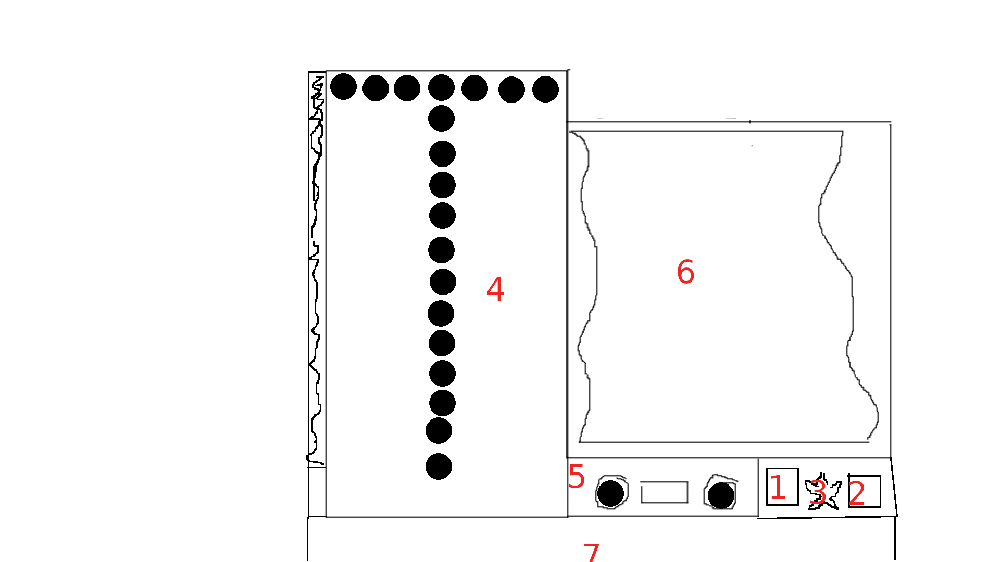

## Roadmap
### Functional
  - [ ] Additional aspect page
  - [ ] Mixing aspects 10x when ALT pressed? (shift + alt + click on aspect in pallet)
  - [ ] Better aspect sorting (depth in tree + alphabetic order) - aspect product is always after it's components

### Non-Functional
  - [ ] Clean-up this and Forgelin 1.9 gradle
  - [ ] Fix asm trying to parse Forgelin zips and failing
  - [ ] Check licensing

## Research table refactor

UI elements:
  - (1) Scribbling tools slot
  - (2) Research paper slot
  - (3) Research duplication button? (check how it worked)
     - not visible till finished & have unlocked duplication
     - shows tooltip on aspect cost?
  - (4) Aspect pallet (7 columns by 13 rows?)
     - has scrolling buttons
  - (5) Aspect combiner
     - left aspect
     - right aspect
     - combine button
  - (6) Drawing paper
     - hex grid
       - individual hexes
        - can connect as lines
     - random runes?
  - (7) Player inventory

