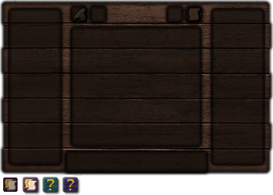

## Roadmap
### Functional
1. Must:
  - [x] Larger aspect pallet for research table
  - [x] Combining aspects via drag & drop
  - [x] Combining 10x aspects when CTRL pressed? (shift + alt + click on aspect in pallet)
  - [x] Combining multiple times when hovering (RMB)
  - [x] Research notes re-implementation
  - [x] Put aspect multiple times on notes when hovering (RMB)
  - [x] Make sure expertise and mastery rules about aspect conservation apply correctly
  - [x] Draw random runes on parchment when researching
  - [ ] Missing ink message
  - [ ] Research duplication
  - [ ] Fix aspect combination notification rendering
  - [ ] Better aspect sorting (depth in tree + alphabetic order + side based on alignment to order,terra,water/perdition,ignis,air) - aspect product is always after it's components
  - [ ] UI textures
  - [ ] Update lang file
  - [ ] Clean up TODOs
  - [ ] Optimize memory consumption (caches)

2. Nice to have:
  - [ ] Testing
  - [ ] Batch aspect combination as one in one packet (see PacketAspectCombinationToServer)
  - [ ] Make aspect layout super stable (aspect is always in same position, even if this means having gaps)

### Non-Functional
  - [ ] Add CI/CD
  - [ ] Migrate and clean-up this and Forgelin 1.9 gradle
  - [ ] Fix asm trying to parse Forgelin zips and failing
  - [ ] Add proper logging
  - [ ] Check licensing

## Research table refactor

UI elements:
  - [x] (I) Scribbling tools slot
  - [x] (N) Research notes slot
  - [ ] (C) Research duplication button? (check how it worked)
     - not present when not unlocked
     - not active till finished & have unlocked duplication
     - shows cost tooltip
  - [x] (1,2) Aspect pallet 4 columns by 13 rows (104 aspect slots)
     - Allows drag & drop aspect combination:
       - Shift + Left click & having research = create this aspect
       - Drop = combine x1
       - Drag + Right click = combine x1
       - (Drop || Drag + Right click) + Ctrl = combine 10
  - [ ] (6) Drawing paper
     - hex grid
       - individual hexes
        - can connect as lines
     - random runes?
  - [x] Player inventory

New UI:



## Development
To run client with specific username set it in `PLAYER_USER_NAME` environment variable.

## Notes
When drawing background he uses:
```
    GL11.glColor4f(1.0f, 1.0f, 1.0f, 1.0f);
    ...
    draw backgrounds
    draw aspects
    ...
    GL11.glColor4f(1.0f, 1.0f, 1.0f, 1.0f);
    RenderHelper.disableStandardItemLighting();
    draw research
```
find out what this changes

notifications are not drawing on top of ui, this should fix it:
```java
    protected void drawGuiContainerForegroundLayer(final int mx, final int my) {
        final Minecraft mc = Minecraft.getMinecraft();
        final long time = System.nanoTime() / 1000000L;
        if (PlayerNotifications.getListAndUpdate(time).size() > 0) {
            GL11.glPushMatrix();
            Thaumcraft.instance.renderEventHandler.notifyHandler.renderNotifyHUD(this.width, this.height, time);
            GL11.glPopMatrix();
        }
    }
```

```
ResearchManager.HexEntry types:
 - `0`: Empty
 - `1`: Root
 - `2`: Placed by user
```

Should I allow replacing aspect when hex already occupied?
