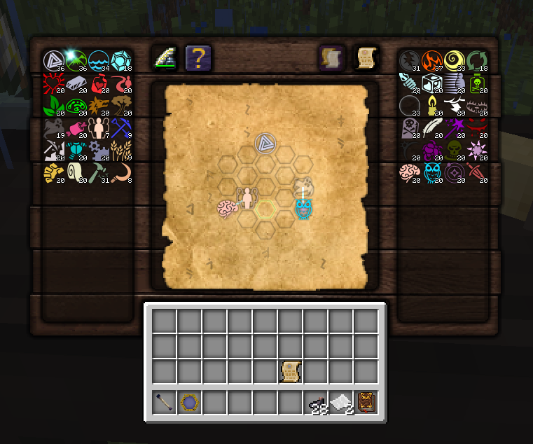

# Thaumcraft 4 research table tweaks

This mod brings a reworked research table GUI.



## Dependency
This mod requires [Forgelin](https://github.com/GTNewHorizons/Forgelin/tags) to work.

## Features
Tutorial and research pages where expanded to include explanations on new features.

All added features are showcased in video format:
- [part 1](https://youtu.be/Q0d8swslIv4)
- [part 2](https://youtu.be/nMNMRcZpb9E)

### Aspect pallets
Aspects pallets are now placed on both sides of the research table.
They split between pallets based on their affinities to order and entropy.
Sorting is based of aspect complexity (products are always below components).

### Aspect combination
Aspect combination area was replaced by drag & drop.
You can also combine aspects while dragging by right-clicking, this way you don't stop dragging.
This also can be used when doing research to place same aspect in multiple hexes.

### Aspect batch combination
It is gated behind research expertise and allows combining aspects up to 10 at a time.
To perform it hold ctrl while combining aspects.
You can also do the same with auto combination unlocked in research mastery.

### Research duplication
Copy button is active only when all required components present (aspects, paper, ink).

## Roadmap

### Functional
Nice to have
- A way to switch (in-game?) to old UI in case a fallback needed
- Configurable bonus aspect particle (change size/turn off)
- Batch aspect combination in one packet (see PacketAspectCombinationToServer)
- Stable aspect layout (aspect is always in same position, even if this means having gaps)
- Old style combine section between scribbling tools and copy button

### Non-functional
Nice to have:
- Migrate gradle to kts
- Automatic Testing

## Maintenance
It is possible to do trivial updates (not introducing new/removing existing concepts) to UI
without diving deep into code base, knowing Kotlin or even having little coding exp.

This mod only adds one new texture, others are sourced from original thaumcraft mod in runtime (to avoid any problems with licensing).
It's encouraged to fiddle with `ResearchTableInventoryTexture` values before any changes to see how it affects the UI.

For example, you need next steps to add one more colum to aspect pools:
1. Replace [main texture](src/main/resources/assets/thaumcraft/textures/research/table/research-table.png) with updated one.
2. Modify [ResearchTableInventoryTexture](src/main/kotlin/elan/tweaks/thaumcraft/research/frontend/integration/table/gui/textures/ResearchTableInventoryTexture.kt),
   this is a texture descriptor.
   It contains all texture related constants which are used to build the UI (origins, column/row count, areas).
   Bump row count in `object AspectPools`.
3. Test and fiddle with `x` coordinates/sizes of various constants found inside until everything looks in place.
4. Make sure to check how it looks with empty scribe tools, put research parchment, etc.

Which is precisely what I've done in [this PR](https://github.com/GTNewHorizons/thaumcraft-research-tweaks/pull/8)
to add 4th column


## Testing tips
Don't forget to test:
- With/without/with empty scribe tools - renders an error message
- With finished/unfinished/empty research papers - rendering of research paper
- With all aspects unlocked (if everything fits alright)
- With all/none research unlocked - if copy button appears correctly

Useful commands:
- Add 10 of all aspects to Developer player (default player name)
```
/thaum aspect Developer all 10
```

- Obtain all research
```
/thaum research Developer all
```

## Known issues

### Aspect from mod X is not showing up in the aspect pools.

**Probable Cause**: Mod X creates its aspects on `FMLLoadCompleteEvent` or later
which causes aspect caching of this mod to miss it.

**Solutions**:
1. Move aspect creation of mod X earlier (e.g. FMLInitializeEvent).
   This would be a preferred solution since aspects should be created early if possible.
2. Drop `AspectTree` initialization in `elan.tweaks.thaumcraft.research.frontend.integration.proxies.ClientSingletonInitializer`
   (two lines, one creating the tree and second one printing).
   This will cause caching on first UI opening.
   This is not crucial, but somewhat reduces UX, since it will cause a small delay

## Credits
Thanks go to:
- Think for texturing my rough ui sketch
- TimeConqueror and GTNH dev's for helping out on technical part
- Azanor for his amazing mod
